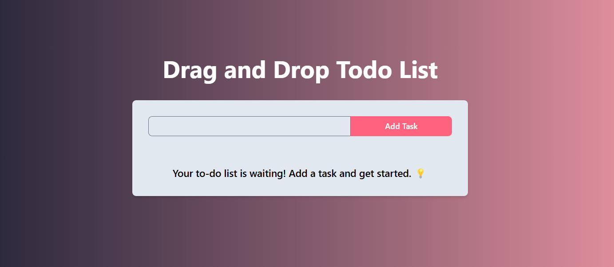
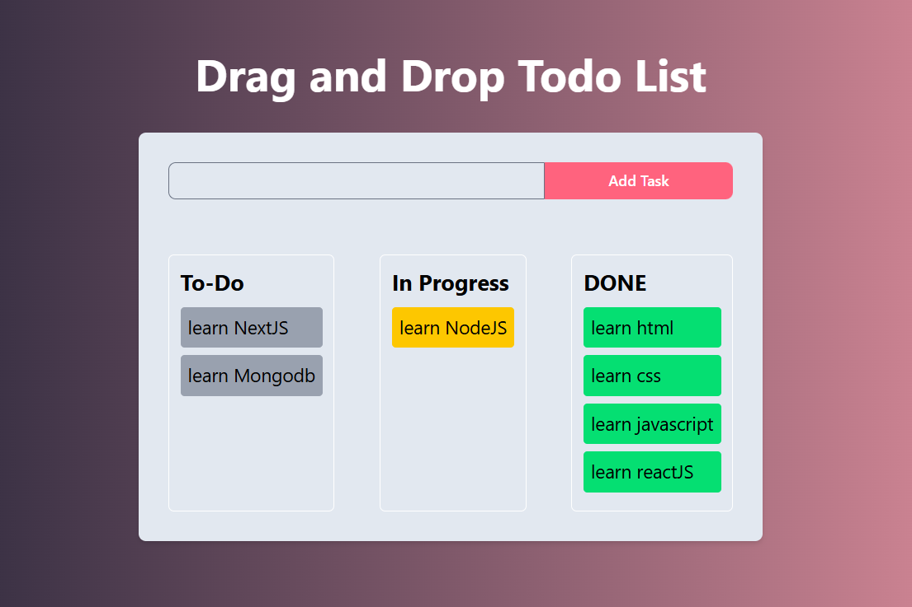

# Drag and Drop Todo App

A simple yet powerful **Drag and Drop Todo App** built with **React.js** and **TailwindCSS**. This app allows users to create tasks, move them between different stages (To-Do, In Progress, Done) using drag-and-drop functionality, and manage their workflow efficiently.

## 🚀 Features

- ✅ **Add Tasks**: Easily add tasks to your to-do list.
- 🎯 **Drag and Drop**: Move tasks between different sections.
- 🌟 **Responsive UI**: Clean and modern design with TailwindCSS.
- ⚡ **Real-Time Updates**: Tasks update dynamically.

## 🛠️ Technologies Used

- **React.js** - For building UI components.
- **TailwindCSS** - For styling and responsiveness.

## 🎯 Getting Started

### 1️⃣ Clone the Repository
```sh
git clone https://github.com/your-username/drag-drop-todo.git
cd drag-drop-todo
```

### 2️⃣ Install Dependencies
```sh
npm install
```

### 3️⃣ Start the App
```sh
npm start
```

## 🔄 How It Works?

1️⃣ Type a task in the input field and click **'Add Task'**.  
2️⃣ Drag the task from **To-Do** and drop it into **In Progress** or **Done**.  
3️⃣ Tasks are updated dynamically and can be moved back if needed.

## 📸 Screenshots




## 🎯 Future Enhancements

- 🔥 **Local Storage**: Save tasks even after page refresh.
- 🎨 **Dark Mode**: Toggle between light and dark themes.
- 🗑️ **Delete Tasks**: Option to remove tasks permanently.

## 🙌 Contributing

Feel free to contribute by submitting a pull request! 🎉

## 📜 License

This project is licensed under the **MIT License**.