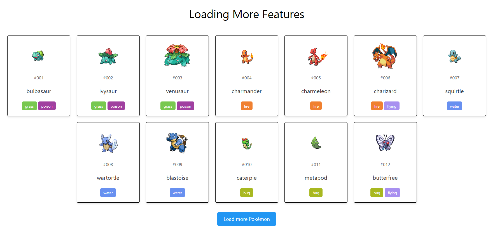

# Load More Products App

A simple React application that implements a "Load More" functionality to display additional products dynamically.

## Features

- Displays a list of products with an option to load more.
- Efficient rendering for better performance.
- Uses React state management.
- Responsive and user-friendly UI.

## Technologies Used

- React.js
- CSS & Tailwind CSS

## Usage

1. The initial set of products is displayed on load.
2. Click the **Load More** button to fetch and display additional products.
3. The button hides when all products are loaded.

## License

This project is open-source and available under the [MIT License](LICENSE).

