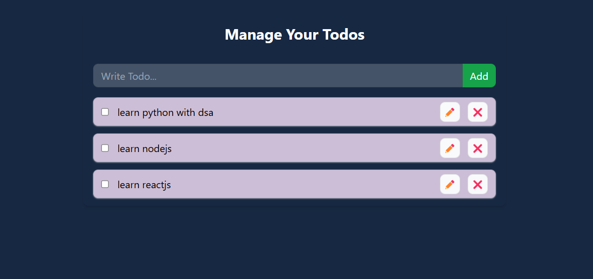

# Todo App with LocalStorage

## Overview
The **Todo App** is a simple yet powerful task management application built with ReactJS. It allows users to add, delete, and mark tasks as completed, with data persistence using LocalStorage.

## Features
- **Add & Remove Tasks** – Easily add new todos and remove completed ones.
- **Mark as Completed** – Toggle task completion status.
- **Persistent Storage** – Uses LocalStorage to retain todos across sessions.
- **Responsive UI** – User-friendly interface for seamless interaction.

## Technologies Used
- **ReactJS** – Frontend framework for a dynamic UI.
- **LocalStorage API** – Stores tasks persistently in the browser.
- **CSS (Tailwind/Styled Components)** – Enhances UI/UX design.

## Usage
1. Enter a task in the input field and press **Add**.
2. Click on a task to mark it as **completed**.
3. Use the delete button to remove tasks.
4. Refreshing the page will not erase tasks due to LocalStorage.

## Future Enhancements
- Add categories for tasks.
- Implement a dark mode toggle.
- Enable drag-and-drop task reordering.

## License
This project is licensed under the **MIT License**.

## Contributing
Feel free to fork the repository, open issues, or submit pull requests to improve the project!
