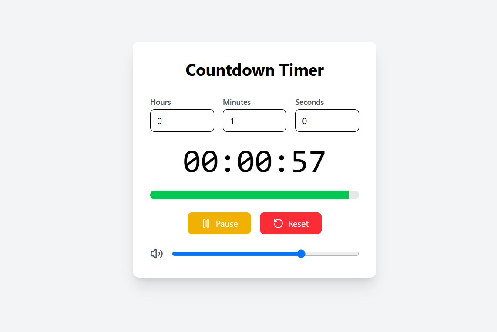

# Advance Countdown Timer

## Overview
This is a **React-based Countdown Timer** with a user-friendly interface that allows users to set a timer, start, pause, and reset it. The timer also includes an alarm that plays when the countdown reaches zero.

## Features
- Set countdown time (hours, minutes, seconds)
- Start, pause, and reset the timer
- Visual progress bar indicating remaining time
- Alarm sound when time is up
- Mute/unmute alarm functionality
- Adjustable volume control
- Responsive and visually appealing UI

## Technologies Used
- **React.js**: Frontend framework
- **Tailwind CSS**: For styling
- **Lucide-react icons**: UI Icons for better user experience

## Usage
1. Enter the countdown time (Hours, Minutes, Seconds)
2. Click the **Start** button to begin the countdown
3. Click **Pause** to pause the timer
4. Click **Reset** to reset the timer to 00:00:00
5. Adjust volume or mute/unmute alarm sound
6. When time is up, an alarm will play and a notification will appear

## Customization
- Modify the alarm sound by changing the `src` attribute in the `<audio>` element.
- Customize styles using Tailwind CSS classes.
- Enhance the UI by adjusting button colors and transitions.

## License
This project is open-source and available for modification and distribution.

---
### Author
Developed by **Shakil Ahmad**

