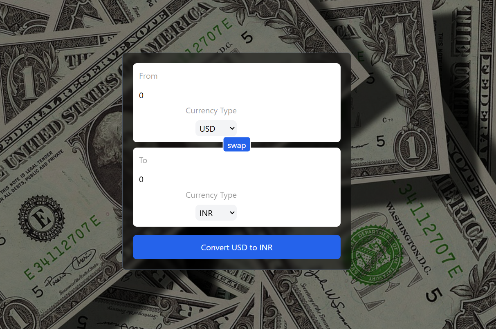

# Currency Converter App

## Overview
The **Currency Converter App** is a real-time currency exchange tool built with ReactJS. It allows users to convert currencies instantly using live exchange rates, providing an intuitive and responsive experience.



## Features
- **Real-time Currency Conversion** – Fetches live exchange rates for accurate conversions.
- **Supports Multiple Currencies** – Choose from various global currencies.
- **Automatic Rate Updates** – Ensures up-to-date exchange rates.
- **User-Friendly Interface** – Simple and intuitive design for seamless usage.
- **Theme Mode** – Light and dark mode support for better user experience.
- **Swap Functionality** – Quickly switch between base and target currencies.
- **Error Handling** – Displays alerts for invalid inputs or API failures.

## Technologies Used
- **ReactJS** – Frontend framework for a dynamic user interface.
- **REST API** – Fetches real-time currency exchange rates.
- **CSS (Tailwind/Styled Components)** – Enhances UI/UX design.
- **Axios/Fetch API** – Handles API requests efficiently.

## Installation
1. Clone the repository:
   ```sh
   git clone https://github.com/your-username/currency-converter.git
   ```
2. Navigate to the project folder:
   ```sh
   cd currency-converter
   ```
3. Install dependencies:
   ```sh
   npm install
   ```
4. Start the application:
   ```sh
   npm start
   ```

## Usage
1. Select base and target currencies.
2. Enter the amount to convert.
3. View real-time conversion rates instantly.
4. Swap currencies for reverse conversion.

## Future Enhancements
- Add cryptocurrency conversion support.
- Implement historical exchange rate charts.
- Offline mode with cached data.
- Multi-language support.

## License
This project is licensed under the **MIT License**.

## Contributing
Feel free to fork the repository, open issues, or submit pull requests to improve the project!
