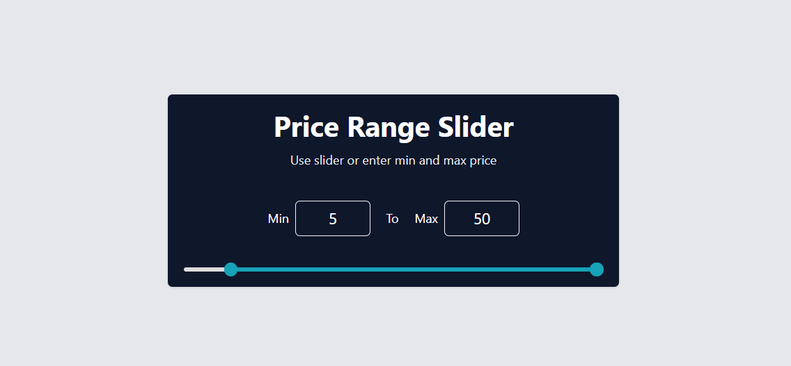

# E-commerce Price Range Slider

This is a **React-based price range slider** component designed for e-commerce applications. Users can adjust the minimum and maximum price using sliders or input fields, with enforced constraints to maintain a valid price gap.



## Features

- Dynamic price range selection.
- Enforces a **minimum price gap** to prevent overlapping values.
- Updates the progress bar based on selected values.
- Responsive design using **Tailwind CSS**.

## Technologies Used

- **React.js**
- **Tailwind CSS**

## Usage

1. Import the `Slider` component into your project:
   ```jsx
   import Slider from "./Slider";
   ```

2. Use the component in your application:
   ```jsx
   function App() {
     return (
       <div>
         <Slider maxPrice={1000} />
       </div>
     );
   }
   export default App;
   ```

3. Adjust the price range using the sliders or input fields.

## Props

| Prop      | Type   | Default | Description                        |
|-----------|--------|---------|------------------------------------|
| `maxPrice` | Number | 1000    | Defines the maximum selectable price. |


## Contributing

Pull requests are welcome! For significant changes, please open an issue first to discuss your ideas.

## License

This project is open-source and available under the [MIT License](LICENSE).