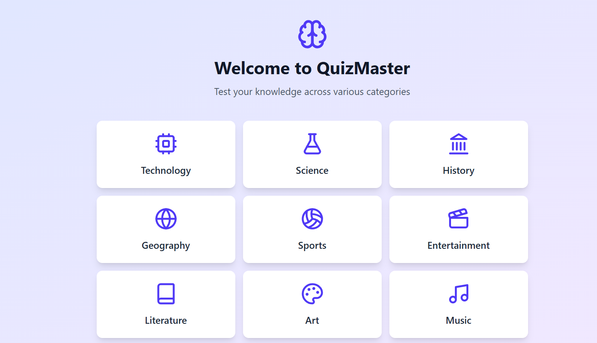
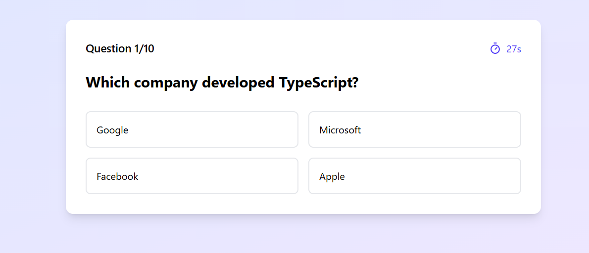
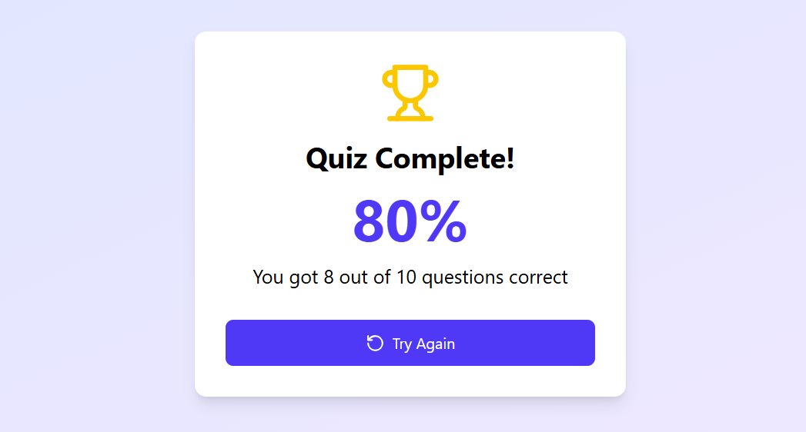

# QuizMaster - Interactive Quiz Application





## 🚀 Overview

QuizMaster is an interactive quiz application built with React and Vite that offers an engaging way to test knowledge across various categories. With a beautiful UI, timer functionality, and instant feedback, it provides an immersive learning experience.

## ✨ Features

- 📚 Multiple quiz categories (Technology, Science, History)
- ⏱️ Timer for each question
- 🎯 Instant feedback on answers
- 📊 Score tracking and percentage calculation
- 🎨 Beautiful, responsive UI with animations
- 🔄 Option to retry the quiz
- 💡 Visual feedback with icons for correct/incorrect answers

## 🛠️ Technologies Used

- React.js
- Vite
- TailwindCSS
- Lucide React Icons

## 🏃‍♂️ Getting Started

### Prerequisites

- Node.js (v14 or higher)
- npm

### Installation

1. Clone the repository:
```bash
git clone https://github.com/yourusername/quizmaster.git
```

2. Navigate to the project directory:
```bash
cd quizmaster
```

3. Install dependencies:
```bash
npm install
```

4. Start the development server:
```bash
npm run dev
```

5. Open your browser and visit `http://localhost:5173`

## 🎮 How to Play

1. Select a quiz category from the home screen
2. Answer each question within the 30-second time limit
3. Get instant feedback on your answers
4. View your final score and percentage at the end
5. Try again to beat your previous score!

## 📁 Project Structure

```
src/
├── components/
│   ├── CategorySelection.jsx
│   ├── Quiz.jsx
│   └── Results.jsx
├── data.js
├── App.jsx
└── main.jsx
```

## 🤝 Contributing

1. Fork the repository
2. Create your feature branch (`git checkout -b feature/AmazingFeature`)
3. Commit your changes (`git commit -m 'Add some AmazingFeature'`)
4. Push to the branch (`git push origin feature/AmazingFeature`)
5. Open a Pull Request

## 📝 License

This project is licensed under the MIT License - see the [LICENSE](LICENSE) file for details.

## 🙏 Acknowledgments

- Icons provided by [Lucide Icons](https://lucide.dev)
- UI design inspired by modern quiz applications
- Background patterns from [TailwindCSS](https://tailwindcss.com)

## 📸 Screenshots

### Home Screen


### Quiz Interface


### Results Screen


## 🔮 Future Enhancements

- [ ] Add more quiz categories
- [ ] Implement user authentication
- [ ] Add leaderboard functionality
- [ ] Create custom quiz option
- [ ] Add difficulty levels
- [ ] Implement multiplayer mode

## 📞 Contact

Your Name - [@yourusername](https://twitter.com/yourusername)

Project Link: [https://github.com/yourusername/quizmaster](https://github.com/yourusername/quizmaster)